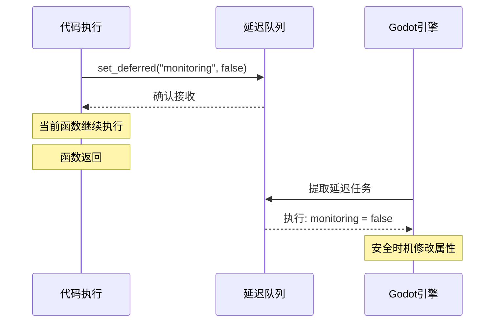

# monitoring 属性与 set_deferred() 安全设置

> [!info] 核心概念
> `monitoring` 是 Area2D 控制是否持续检测碰撞的开关。`set_deferred()` 用于延迟设置属性，避免在特殊生命周期阶段直接修改属性导致的冲突或崩溃。

## 目录

- [monitoring 属性详解](#monitoring-属性详解)
- [set_deferred() 详解](#set_deferred-详解)
- [实际应用场景](#实际应用场景)
- [单次命中 vs 穿透群伤策略](#单次命中-vs-穿透群伤策略)
- [完整代码示例](#完整代码示例)
- [常见问题与解决方案](#常见问题与解决方案)

## monitoring 属性详解

### 基本概念

`monitoring` 是 `Area2D` 的布尔属性，用于控制是否持续进行碰撞检测：

| 属性值 | 效果 |
|--------|------|
| `true` | Area2D 持续检测进入其区域的物体（默认） |
| `false` | 关闭碰撞检测，不再触发 `area_entered` 信号 |

```gdscript
# 查看当前监测状态
print(monitoring)  # 默认输出: true

# 关闭碰撞检测
monitoring = false
```

### 典型应用场景

> [!tip] 适用场景
> - 单次命中子弹：第一次命中后关闭，防止重复触发
> - 弹药拾取物：检测到玩家后立即关闭
> - 区域触发器：触发一次后不再响应
> - 一次性特效：触发后停止检测

```gdscript
extends Area2D

@export var can_pick_multiple: bool = false
var has_been_picked: bool = false

func _on_area_entered(area: Area2D) -> void:
    if area.is_in_group("Player"):
        if not can_pick_multiple and has_been_picked:
            return

        # 拾取逻辑
        collect_item(area)

        if not can_pick_multiple:
            # 单次拾取：关闭监测
            set_deferred("monitoring", false)
            has_been_picked = true
```

### 与 collision_mask 的区别

| 属性 | 作用 | 性能影响 |
|------|------|----------|
| `monitoring` | 完全开启/关闭碰撞检测 | 高（关闭后完全不检测） |
| `collision_mask` | 设置检测哪些层 | 低（仍会检测，只是不响应某些层） |

```gdscript
# monitoring = false：完全停止碰撞检测
# collision_mask = 0：仍会检测但不匹配任何层
```

## set_deferred() 详解

### 基本概念

`set_deferred()` 是 Godot 中延迟设置属性的函数，将属性修改推迟到安全的时机执行（通常是下一帧）。

```gdscript
# 语法
set_deferred("property_name", value)

# 示例
set_deferred("monitoring", false)
set_deferred("position", Vector2(100, 100))
set_deferred("visible", true)
```

### 为什么需要 set_deferred()

> [!warning] 直接修改的风险
> 在某些特殊的生命周期阶段（如信号回调、物理过程回调），直接修改属性可能与引擎内部状态产生冲突，导致错误甚至崩溃。

**直接修改可能触发问题的场景**：

```gdscript
# ❌ 危险示例：在信号回调中直接修改
func _on_area_entered(area: Area2D) -> void:
    # 此时 Godot 引擎可能正在处理碰撞检测
    # 直接修改 monitoring 可能导致：
    # 1. 正在进行的检测被中断
    # 2. 内部状态不一致
    # 3. 可能的崩溃
    monitoring = false

# ✅ 安全示例：使用 set_deferred()
func _on_area_entered(area: Area2D) -> void:
    # 将修改推迟到回调结束后执行
    set_deferred("monitoring", false)
```

### 工作原理



### 必须使用 set_deferred() 的场景

| 场景 | 直接修改风险 | 使用原因 |
|------|-------------|----------|
| `area_entered` 信号回调 | 高 | 可能与碰撞检测内部状态冲突 |
| `_ready()` 中某些属性 | 中 | 场景树尚未完全建立 |
| 物理 `_physics_process` 中 | 高 | 可能破坏物理计算 |
| `_process()` 中修改节点状态 | 低 | 通常安全，但复杂场景建议使用 |
| 多线程回调中 | 高 | 线程安全问题 |

```gdscript
# ✅ 正确的使用方式

# 1. 在信号回调中使用
func _on_area_entered(area: Area2D) -> void:
    set_deferred("monitoring", false)

# 2. 在物理回调中使用
func _physics_process(delta: float) -> void:
    if should_disable:
        set_deferred("monitoring", false)

# 3. 在 _ready() 中安全修改
func _ready() -> void:
    # 某些属性的修改需要延迟
    await get_tree().process_frame  # 等待一帧
    set_deferred("monitoring", true)

# ❌ 错误的使用方式

# 1. 在循环中大量使用（性能问题）
func _process(delta: float) -> void:
    for i in range(100):
        set_deferred("position", new_pos)  # 性能开销大

# 2. 在同一帧多次修改同一属性
set_deferred("monitoring", false)
set_deferred("monitoring", true)  # 后面的覆盖前面的
```

## 实际应用场景

### 场景一：单次命中子弹

```gdscript
extends Area2D

@export var damage: int = 10
@export var speed: float = 300.0

var has_hit: bool = false

func _process(delta: float) -> void:
    position += transform.x * speed * delta

func _on_area_entered(area: Area2D) -> void:
    if area.is_in_group("Player"):
        if has_hit:
            return  # 已经命中过

        # 造成伤害
        if area.has_method("take_damage"):
            area.take_damage(damage)

        # 标记已命中并关闭碰撞检测
        has_hit = true
        set_deferred("monitoring", false)
        queue_free()
```

### 场景二：穿透子弹（可命中多个目标）

```gdscript
extends Area2D

@export var damage: int = 10
@export var speed: float = 400.0
@export var cooldown_time: float = 0.05  # 无敌帧时长

func _process(delta: float) -> void:
    position += transform.x * speed * delta

func _on_area_entered(area: Area2D) -> void:
    if area.is_in_group("Player"):
        if area.has_method("take_damage"):
            area.take_damage(damage)

        # 短暂无敌帧，避免重复检测同一目标
        _enable_penetration_cooldown()

func _enable_penetration_cooldown() -> void:
    # 临时禁用碰撞检测
    set_deferred("monitoring", false)
    await get_tree().create_timer(cooldown_time).timeout
    # 恢复碰撞检测
    set_deferred("monitoring", true)
```

### 场景三：弹药拾取物

```gdscript
extends Area2D

@export var ammo_amount: int = 30
@export var can_stack: bool = false  # 是否可重复拾取

var has_been_collected: bool = false

func _on_area_entered(area: Area2D) -> void:
    if area.is_in_group("Player"):
        if not can_stack and has_been_collected:
            return

        # 添加弹药
        if area.has_method("add_ammo"):
            area.add_ammo(ammo_amount)

        # 播放拾取音效
        play_pickup_sound()

        if not can_stack:
            # 单次拾取：关闭监测并销毁
            set_deferred("monitoring", false)
            has_been_collected = true
            create_pickup_effect()
            await get_tree().create_timer(0.5).timeout
            queue_free()
        else:
            # 可重复拾取：创建短暂冷却
            create_pickup_cooldown()

func create_pickup_cooldown() -> void:
    set_deferred("monitoring", false)
    await get_tree().create_timer(0.1).timeout
    set_deferred("monitoring", true)

func play_pickup_sound() -> void:
    # 播放音效逻辑
    pass

func create_pickup_effect() -> void:
    # 创建拾取特效
    pass
```

### 场景四：一次性触发器

```gdscript
extends Area2D

@export var trigger_message: String = "区域已激活"
var has_triggered: bool = false

func _on_area_entered(area: Area2D) -> void:
    if has_triggered:
        return

    if area.is_in_group("Player"):
        # 显示触发信息
        show_trigger_message(trigger_message)

        # 执行触发逻辑
        execute_trigger_logic(area)

        # 标记已触发并关闭
        has_triggered = true
        set_deferred("monitoring", false)

        # 可选：淡出效果后销毁
        await get_tree().create_timer(2.0).timeout
        fade_out_and_destroy()

func execute_trigger_logic(area: Area2D) -> void:
    # 触发逻辑
    pass

func show_trigger_message(message: String) -> void:
    # 显示消息
    pass

func fade_out_and_destroy() -> void:
    # 淡出销毁
    queue_free()
```

## 单次命中 vs 穿透群伤策略

| 策略 | monitoring 设置 | 适用场景 |
|------|-----------------|----------|
| **单次命中** | 第一次命中后设为 `false` | 普通子弹、追踪弹、拾取物 |
| **穿透群伤** | 始终保持 `true` | 霰弹枪、爆炸范围技能 |
| **短暂无敌帧** | 命中后短暂禁用再恢复 | 防止单次接触重复判定 |

### 策略对比表

```gdscript
# 策略选择指南
var strategy = {
    "single_hit": {
        "description": "只能命中一个目标",
        "monitoring_after_hit": false,
        "cooldown": null,
        "use_case": "普通子弹、弓箭"
    },
    "penetrate": {
        "description": "可以穿透并命中多个目标",
        "monitoring_after_hit": true,
        "cooldown": 0.05,
        "use_case": "霰弹枪、穿透箭"
    },
    "aoe": {
        "description": "范围伤害，检测所有目标",
        "monitoring_after_hit": true,
        "cooldown": null,
        "use_case": "爆炸弹、魔法AOE"
    }
}
```

### 实际选择建议

> [!question] 如何选择？
>
> - **单次命中**：当你希望每个子弹只造成一次伤害时
> - **穿透群伤**：当子弹需要穿过多个目标时
> - **短暂无敌帧**：当需要防止单次接触重复判定但又希望继续检测其他目标时

## 完整代码示例

### 完整的子弹脚本

```gdscript
class_name Bullet
extends Area2D

## 子弹属性
@export_group("基本属性")
@export var speed: float = 300.0
@export var damage: int = 10
@export var lifetime: float = 3.0  # 存活时间（秒）

## 碰撞设置
@export_group("碰撞设置")
@export var hit_multiple: bool = false  # 是否可命中多个目标
@export var cooldown_time: float = 0.05  # 穿透无敌帧时长
@export var destroy_on_hit: bool = true  # 命中后是否销毁

## 内部状态
var _has_hit: bool = false
var _current_lifetime: float = 0.0
var _is_active: bool = true

## 节点引用
@onready var _sprite: Sprite2D = $Sprite2D
@onready var _collision_shape: CollisionShape2D = $CollisionShape2D
@onready var _visible_notifier: VisibleOnScreenNotifier2D = $VisibleOnScreenNotifier2D

func _ready() -> void:
    # 连接信号
    area_entered.connect(_on_area_entered)
    _visible_notifier.screen_exited.connect(_on_screen_exited)

    # 初始化碰撞掩码
    _init_collision_mask()

func _init_collision_mask() -> void:
    # 设置碰撞层和掩码
    collision_layer = 2  # 子弹层
    collision_mask = 1   # 检测玩家层

func _process(delta: float) -> void:
    if not _is_active:
        return

    # 更新存活时间
    _current_lifetime += delta

    # 超时自动销毁
    if _current_lifetime >= lifetime:
        _destroy_bullet()
        return

    # 移动逻辑
    _move(delta)

func _move(delta: float) -> void:
    position += transform.x * speed * delta

func _on_area_entered(area: Area2D) -> void:
    if not _is_active:
        return

    # 检查是否命中玩家
    if area.is_in_group("Player"):
        # 命中检测
        if not hit_multiple and _has_hit:
            return

        # 造成伤害
        _apply_damage(area)

        # 命中后处理
        _handle_hit()

func _apply_damage(target: Area2D) -> void:
    if target.has_method("take_damage"):
        target.take_damage(damage)

func _handle_hit() -> void:
    if not hit_multiple:
        # 单次命中：关闭碰撞检测
        _has_hit = true
        set_deferred("monitoring", false)

        if destroy_on_hit:
            _destroy_bullet()
    else:
        # 穿透：短暂无敌帧
        _enable_penetration_cooldown()

func _enable_penetration_cooldown() -> void:
    if cooldown_time > 0:
        set_deferred("monitoring", false)
        await get_tree().create_timer(cooldown_time).timeout
        set_deferred("monitoring", true)

func _on_screen_exited() -> void:
    _destroy_bullet()

func _destroy_bullet() -> void:
    if not _is_active:
        return

    _is_active = false

    # 禁用碰撞检测
    set_deferred("monitoring", false)

    # 播放销毁特效（可选）
    _play_destroy_effect()

    # 延迟销毁，等待特效播放
    await get_tree().create_timer(0.1).timeout
    queue_free()

func _play_destroy_effect() -> void:
    # 可在此添加销毁特效
    pass

## 公共接口
func set_speed(new_speed: float) -> void:
    speed = new_speed

func set_damage(new_damage: int) -> void:
    damage = new_damage

func set_penetration(enable: bool, cooldown: float = 0.05) -> void:
    hit_multiple = enable
    cooldown_time = cooldown
```

### 子弹管理器（对象池）

```gdscript
class_name BulletManager
extends Node

## 单例模式
static var instance: BulletManager

## 子弹预制体
@export var bullet_scene: PackedScene

## 对象池
var _pool: Array[Bullet] = []
var _active_bullets: Array[Bullet] = []

## 池配置
const POOL_SIZE: int = 50
const POOL_EXPANSION: int = 10

func _ready() -> void:
    instance = self
    _prewarm_pool(POOL_SIZE)

func _prewarm_pool(count: int) -> void:
    for i in range(count):
        var bullet = _create_bullet_from_pool()
        _return_to_pool(bullet)

func _create_bullet_from_pool() -> Bullet:
    if bullet_scene:
        return bullet_scene.instantiate()
    else:
        return Bullet.new()

## 从池中获取子弹
func get_bullet() -> Bullet:
    var bullet: Bullet

    if _pool.is_empty():
        # 扩展池
        for i in range(POOL_EXPANSION):
            var new_bullet = _create_bullet_from_pool()
            _return_to_pool(new_bullet)

    bullet = _pool.pop_back()
    bullet.visible = true
    bullet.process_mode = PROCESS_MODE_INHERIT

    # 重置子弹状态
    bullet._has_hit = false
    bullet._current_lifetime = 0.0
    bullet._is_active = true
    bullet.set_deferred("monitoring", true)

    _active_bullets.append(bullet)
    return bullet

## 将子弹归还到池
func return_to_pool(bullet: Bullet) -> void:
    if bullet in _active_bullets:
        _active_bullets.erase(bullet)

    bullet.visible = false
    bullet.process_mode = PROCESS_MODE_DISABLED
    bullet.set_deferred("monitoring", false)
    bullet.position = Vector2.ZERO

    _pool.append(bullet)

## 批量发射子弹
func shoot_bullets(
    origin: Vector2,
    direction: float,
    count: int,
    spread_angle: float = 15.0,
    speed: float = 300.0,
    damage: int = 10
) -> void:
    for i in range(count):
        var bullet = get_bullet()
        bullet.global_position = origin
        bullet.rotation = direction + deg_to_rad(spread_angle * (i - count / 2.0))
        bullet.set_speed(speed)
        bullet.set_damage(damage)

        get_parent().add_child(bullet)

## 清理所有活动子弹
func clear_active_bullets() -> void:
    for bullet in _active_bullets:
        if is_instance_valid(bullet):
            bullet._destroy_bullet()
    _active_bullets.clear()
```

## 常见问题与解决方案

### 问题一：子弹命中后仍然触发多次

> [!bug] 问题描述
> 子弹命中一个目标后，有时会继续触发 `area_entered` 信号，导致重复伤害。

**原因分析**：
- 在信号回调中直接修改 `monitoring`，但此时碰撞检测仍在进行
- 同一帧内多次进入碰撞区域

**解决方案**：
```gdscript
# ❌ 错误做法
func _on_area_entered(area: Area2D) -> void:
    monitoring = false  # 可能无效

# ✅ 正确做法
func _on_area_entered(area: Area2D) -> void:
    set_deferred("monitoring", false)
    # 添加额外保护
    _has_hit = true
```

### 问题二：使用 set_deferred() 后属性没有立即改变

> [!question] 问题描述
> 调用 `set_deferred()` 后立即检查属性值，发现仍然是旧值。

**原因分析**：
- `set_deferred()` 是延迟执行，不会立即改变属性值

**解决方案**：
```gdscript
# ❌ 错误：立即检查
set_deferred("monitoring", false)
print(monitoring)  # 仍然输出 true

# ✅ 正确：使用信号或等待
set_deferred("monitoring", false)
await get_tree().process_frame  # 等待一帧
print(monitoring)  # 输出 false
```

### 问题三：穿透子弹重复命中同一目标

> [!bug] 问题描述
> 穿透子弹在穿过一个目标时，会在同一帧内多次触发 `area_entered`。

**原因分析**：
- 碰撞形状重叠导致多次进入
- 没有无敌帧保护

**解决方案**：
```gdscript
# 添加无敌帧
var _cooldown_areas: Array[Area2D] = []

func _on_area_entered(area: Area2D) -> void:
    if area in _cooldown_areas:
        return  # 在冷却中

    # 处理命中
    _process_hit(area)

    # 添加到冷却列表
    if hit_multiple:
        _cooldown_areas.append(area)
        await get_tree().create_timer(cooldown_time).timeout
        _cooldown_areas.erase(area)
```

### 问题四：子弹在边界处异常

> [!bug] 问题描述
> 子弹在接触边界或角落时，碰撞检测表现异常。

**原因分析**：
- 碰撞形状在边界处被裁剪
- 物体运动速度过快导致穿模

**解决方案**：
```gdscript
# 1. 增加碰撞检测频率
func _physics_process(delta: float) -> void:
    # 使用物理进程代替普通进程
    _move(delta)

# 2. 使用射线检测补充
func _check_rapid_movement() -> void:
    var motion = transform.x * speed * get_physics_process_delta_time()
    var space_state = get_world_2d().direct_space_state
    var query = PhysicsRayQueryParameters2D.create(global_position, global_position + motion)
    var result = space_state.intersect_ray(query)

    if result:
        _handle_collision(result.collider)

# 3. 增大碰撞形状
func _ready() -> void:
    # 使碰撞形状比视觉效果稍大
    $CollisionShape2D.scale = Vector2(1.2, 1.2)
```

### 问题五：性能问题 - 大量子弹导致卡顿

> [!warning] 问题描述
> 当场景中存在大量子弹时，游戏出现明显卡顿。

**原因分析**：
- 每个子弹都在进行碰撞检测
- 频繁创建和销毁子弹对象

**解决方案**：
```gdscript
# 1. 使用对象池（推荐）
# 参见上面的 BulletManager 示例

# 2. 减少碰撞检测频率
func _physics_process(delta: float) -> void:
    # 每2帧检测一次
    Engine.physics_ticks_per_second = 60

# 3. 简化碰撞形状
func _ready() -> void:
    # 使用圆形碰撞代替复杂形状
    var circle = CircleShape2D.new()
    circle.radius = 5.0
    $CollisionShape2D.shape = circle

# 4. 及时销毁
func _process(delta: float) -> void:
    # 检查是否超出屏幕
    if not _is_on_screen():
        _destroy_bullet()
```

---

## 相关笔记

- [[Area2D 碰撞检测基础]]
- [[信号系统详解]]
- [[对象池技术]]
- [[EnemyBullet-子弹运动]]

---

> [!note]
> **学习建议**：
> 1. 先理解 `monitoring` 和 `collision_mask` 的区别
> 2. 掌握 `set_deferred()` 的使用场景
> 3. 在实际项目中练习不同碰撞策略
> 4. 使用对象池优化大量子弹的性能
