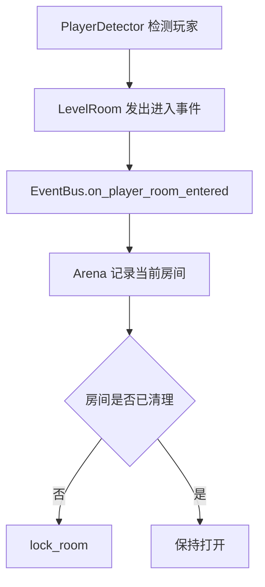

# 房间锁定与玩家生成

这次学习重点是把“玩家进入房间”变成一个可以被 Arena、房间门、后续敌人系统共同响应的事件。核心做法不是让房间直接操作全局流程，而是通过 `EventBus` 把进入事件广播出去，再由 Arena 判断是否需要锁房。

## 核心链路

## 学到的 Godot 点

- `Area2D.body_entered` 适合做房间触发器，前提是玩家的 `collision_layer` 和检测器的 `collision_mask` 对齐。
- 房间门可以用独立的 `TileMapLayer` 控制显示和碰撞，通过 `enabled` 实现打开和关闭。
- 起始房间应该在生成阶段就标记为 `is_start_room` 和 `is_cleared`，否则玩家出生后可能立刻触发锁房。
- 玩家出生点不应该写死世界坐标，而应该来自起始房间里的 `Marker2D`，这样房间尺寸和布局变化时不需要重写玩家生成逻辑。

## 关键实现理解

### LevelRoom

`LevelRoom` 负责本房间内部状态：检测玩家进入、锁门、解锁门、打开墙壁。它只暴露房间行为，不直接决定全局关卡状态。

### EventBus

`EventBus.on_player_room_entered(room)` 让房间进入事件可以被 Arena、小地图、敌人管理等系统复用。这个信号是房间系统后续扩展的关键入口。

### Arena

Arena 订阅房间进入事件后，根据 `room.is_cleared` 决定是否调用 `lock_room()`。这种写法把“房间如何锁”留给房间，把“什么时候锁”留给 Arena。

## 待清理问题

- `room.gd` 里用于测试的 `ui_accept` / `ui_cancel` 输入处理后续应该移除或改成调试开关。
- 锁房最终应该和敌人生成、敌人清空事件连起来，而不是只依赖进入房间。
- 需要确认玩家高速移动时不会连续触发多个房间检测器。

## 相关笔记

- [[enter-the-dungeon-demo项目学习/程序化关卡生成|程序化关卡生成]]
- [[enter-the-dungeon-demo项目学习/小地图|小地图系统]]
- [[enter-the-dungeon-demo项目学习/资源与场景关系|资源与场景关系]]
