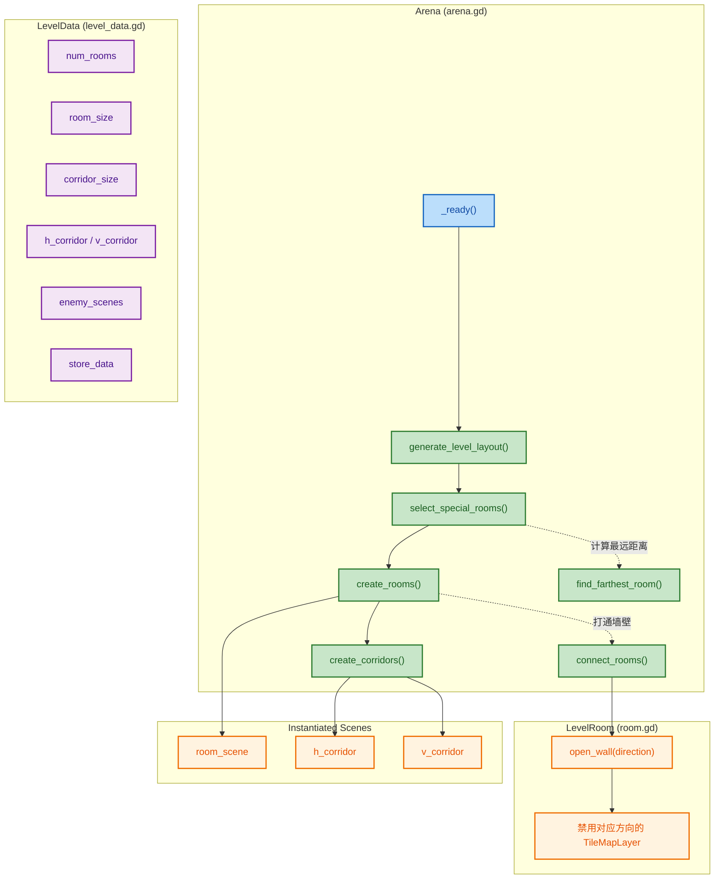
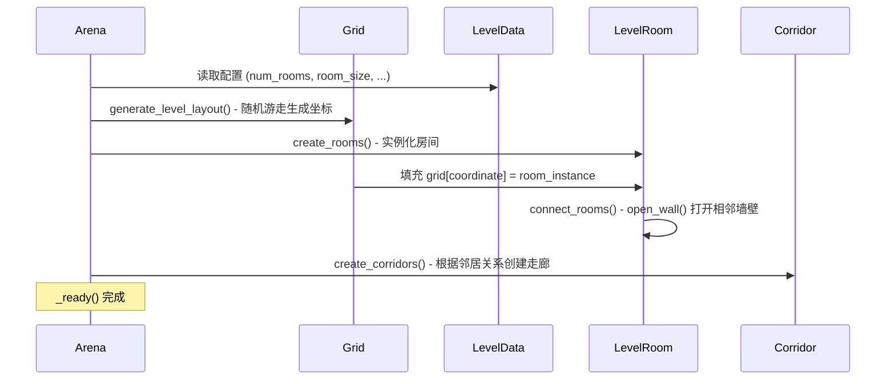

## 1. 高阶总结 (TL;DR)
*   **影响程度:** 🔴 **高** - 本次提交为游戏引入了完整的程序化关卡生成（Procedural Generation）机制，重构了竞技场（Arena）的初始化流程。
*   **核心变更:**
    *   ✨ **引入随机游走算法:** 在 `arena.gd` 中实现了生成关卡网格布局的算法，动态决定房间的位置。
    *   🏗️ **走廊与房间实例化:** 新增了水平和垂直走廊场景的支持，并根据相邻房间自动创建走廊连接。
    *   🚪 **动态墙壁管理:** 重构了房间场景（`level_01_room.tscn` / `room.gd`），支持根据关卡拓扑自动打开或关闭特定方向的墙壁。
    *   📍 **起点与终点计算:** 实现了基于欧几里得距离寻找离起点最远房间作为终点的逻辑。
    *   🗂️ **关卡配置数据化:** 通过 `LevelData` Resource 集中管理所有关卡参数（房间数、尺寸、敌人配置、商铺数据等）。

## 2. 视觉概览 (代码与逻辑映射)



## 3. 详细变更分析

### 3.1 关卡配置 (LevelData)

扩展了关卡资源数据 `Data/Level/Level_01.tres`，以支持不同类型的走廊和网格计算。

| 属性名 | 类型 | 默认值 | 说明 |
| :--- | :--- | :--- | :--- |
| `num_sub_levels` | `int` | `4` | 子关卡数量 |
| `num_rooms` | `int` | `10` | 目标房间数量 |
| `room_size` | `Vector2i` | `(384, 384)` | 房间尺寸（像素） |
| `room_scene` | `PackedScene` | - | 房间场景引用 |
| `h_corridor` | `PackedScene` | - | 水平走廊场景引用 |
| `v_corridor` | `PackedScene` | - | 垂直走廊场景引用 |
| `corridor_size` | `Vector2i` | `(192, 192)` | 走廊尺寸（像素） |
| `min_enemies_per_room` | `int` | `5` | 每房间最小敌人数量 |
| `max_enemies_per_room` | `int` | `10` | 每房间最大敌人数量 |
| `enemy_scenes` | `Array[PackedScene]` | - | 敌人场景组 |
| `store_data` | `Array[LevelStoreData]` | - | 关卡商铺数据 |

> **相关文件:**
> - `Data/Level/level_data.gd` - LevelData Resource 类定义
> - `Data/Level/level_store_data.gd` - LevelStoreData（商铺道具配置）
> - `Data/Level/Level_01.tres` - LevelData 实例（Inspector 中赋值）

### 3.2 竞技场关卡生成 (`arena.gd`)

Arena 是整个关卡的总管理器，继承自 `Node2D`，负责协调整个关卡的生成流程。

#### 网格系统

```gdscript
var grid: Dictionary[Vector2i, LevelRoom] = {}  # 坐标 -> 房间实例
var grid_cell_size: Vector2i  # = room_size + corridor_size
```

世界坐标计算公式：`room_instance.position = room_coordinate * grid_cell_size`

#### 随机游走算法 (`generate_level_layout()`)

```
算法步骤:
1. 从原点 (0,0) 开始，将其加入 grid（value = null 占位）
2. 循环直到 grid.size() >= num_rooms 或达到最大迭代次数
   2a. 50% 概率随机跳跃到已有坐标（增加随机性）
   2b. 随机选择一个方向尝试扩展
   2c. 如果目标坐标已存在，最多重试10次换一个方向
   2d. 确认新坐标不重复后加入 grid
3. 未达目标时 push_warning 警告
```

#### 房间创建 (`create_rooms()`)

```gdscript
for room_coordinate in grid.keys():
    var room_instance = level_data.room_scene.instantiate()
    room_instance.position = room_coordinate * grid_cell_size
    add_child(room_instance)
    grid[room_coordinate] = room_instance          # null → 实际对象
    connect_rooms(room_coordinate, room_instance)  # 打开相邻墙壁
```

> **注意:** grid 的初始 value 为 `null`，在 `create_rooms()` 中被实际房间实例替换。

#### 走廊创建 (`create_corridors()`)

```gdscript
# 遍历每个房间
for room_coordinate in grid.keys():
    # 右侧邻居 → 水平走廊
    if grid.has(room_coordinate + Vector2i.RIGHT):
        corridor.position = room_instance.position + Vector2(grid_cell_size.x / 2.0, 0)

    # 下方邻居 → 垂直走廊
    if grid.has(room_coordinate + Vector2i.DOWN):
        corridor.position = room_instance.position + Vector2(0, grid_cell_size.y / 2.0)
```

#### 特殊房间选择 (`select_special_rooms()`)

```gdscript
start_room_coordinate = Vector2i.ZERO  # 起点固定为原点
end_room_coordinate = find_farthest_room()  # 终点 = 欧几里得距离最远的房间
```

### 3.3 房间内部逻辑 (`room.gd`)

每个房间实例（`LevelRoom`）独立管理自己的四面墙壁。

#### 墙壁节点映射

```gdscript
@onready var room_walls: Dictionary[Vector2i, TileMapLayer] = {
    Vector2i.UP: %WallUp,
    Vector2i.RIGHT: %WallRight,
    Vector2i.DOWN: %WallDown,
    Vector2i.LEFT: %WallLeft
}
```

#### 墙壁控制

```gdscript
func open_wall(direction: Vector2i) -> void:
    if room_walls.has(direction):
        room_walls[direction].enabled = false  # 禁用 TileMapLayer

func close_all_walls() -> void:
    for key in room_walls:
        room_walls[key].enabled = true
```

> **节点命名:** 墙壁节点使用 `%WallUp` 等唯一名称（`unique_name_in_owner = true`），使脚本可在不知道节点路径的情况下直接访问。

### 3.4 走廊场景 (`level_01_h_corridor.tscn` / `level_01_v_corridor.tscn`)

走廊是独立的 `PackedScene`，实例化后放置于两相邻房间之间中点位置。尺寸由 `level_data.corridor_size` 决定。

## 4. 关卡生成流程总览



## 5. 影响与风险评估

*   ⚠️ **玩家加载暂时禁用:** `arena.gd` 的 `_ready()` 中 `load_game_selection()` 被注释掉，玩家角色目前不会被生成。这是开发调试状态。
*   ⚠️ **生成死锁风险:** `while` 循环有安全退出机制（`max_iterations = num_rooms * 10`，单方向重试上限10次）。极端情况下可能生成房间数少于预期，已通过 `push_warning` 提示。
*   ⚠️ **走廊仅支持右和下:** 当前走廊逻辑只检查右侧 (`RIGHT`) 和下方 (`DOWN`) 邻居，理论上可以覆盖所有连接（因为 LEFT 和 UP 的连接由相邻房间的 RIGHT/DOWN 检查覆盖）。
*   🧪 **测试建议:**
    1. 运行游戏多次，检查是否每次都能成功生成预定数量的房间且不崩溃。
    2. 观察生成的关卡，确保走廊与房间连接处无错位，墙壁开口方向正确。
    3. 确认终点房间计算符合预期（视觉上距离起点最远）。
